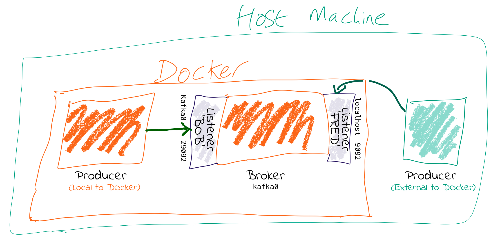
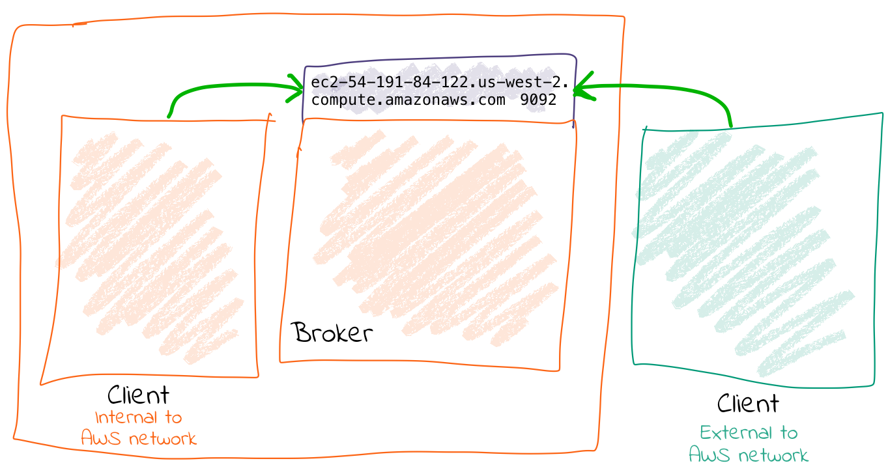
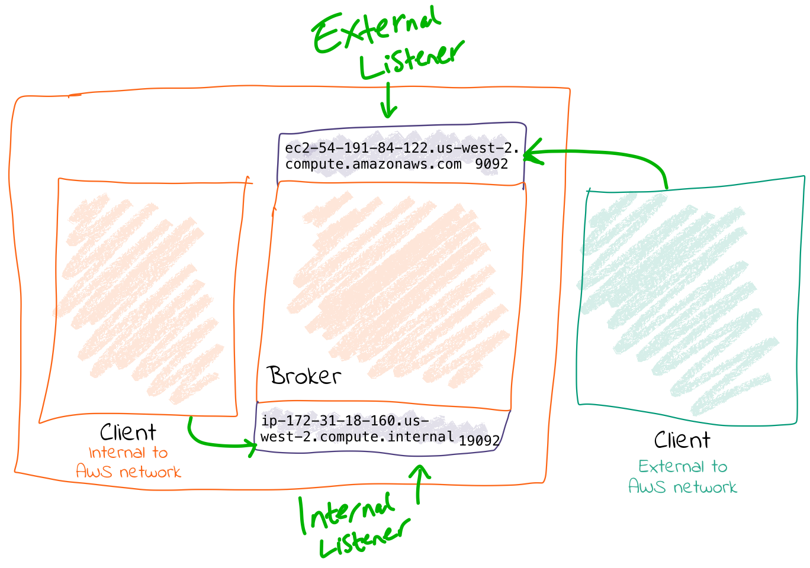

= Kafka Listeners - Explained
Robin Moffatt <robin@confluent.io>
v0.10, 30 Jul 2018`

This question comes up on StackOverflow a **lot**, so here's a Googlable blog to help. 

**tl;dr** : You need to set `advertised.listeners` (or `KAFKA_ADVERTISED_LISTENERS` if you're using Docker images) to the external address (host/IP) so that clients can correctly connect to it. Otherwise they'll try to connect to the internal IP (since `advertised.listeners` will default to `listeners` unless explicitly set)

== Is anyone listening? 

Kafka is a distributed system. Data is read from & written to the _Leader_ for a given partition, which could be on any of the brokers in a cluster. When a client (producer/consumer) starts, it will request metadata about which broker is the leader for a partition from—and it can do this from _any_ broker. The metadata returned will include the endpoints available for the Leader broker for that partition, and the client will then use those endpoints to connect to the broker to read/write data as required. 

It's these endpoints that cause people trouble. On a *single machine, running 'bare metal'* (no VMs, no Docker), everything might be the hostname (or just *`localhost`*) and it's easy. But once you move into more complex networking setups, and multiple nodes, you have to pay more attention to it. 

Let's assume you have more than one network. This could be things like: 

- Docker internal network(s) plus host machine
- Brokers in the cloud (eg. AWS EC2), and on-premises machines locally (or even in another cloud)

You need to tell Kafka how the brokers can reach each other, but also make sure that external clients (producers/consumers) can reach the broker they need to. 

*The key thing is that when you run a client, the broker you pass to it is _just where it's going to go and get the metadata about brokers in the cluster from_. The actual host & IP that it will connect to for reading/writing data is based on _the data that the broker passes back in that initial connection_—even if it's just a single node and the broker returned is the same as the one connected to.* 

For configuring this correctly, you need to understand that Kafka brokers can have multiple _listeners_. A listener is a combination of 

1. Host/IP
2. Port
3. Protocol

Let's check out some config. Often the protocol is used for the listener name too, but here let's make it nice and clear by using abstract names for the listeners:  

      KAFKA_LISTENERS: LISTENER_BOB://kafka0:29092,LISTENER_FRED://localhost:9092
      KAFKA_ADVERTISED_LISTENERS: LISTENER_BOB://kafka0:29092,LISTENER_FRED://localhost:9092
      KAFKA_LISTENER_SECURITY_PROTOCOL_MAP: LISTENER_BOB:PLAINTEXT,LISTENER_FRED:PLAINTEXT
      KAFKA_INTER_BROKER_LISTENER_NAME: LISTENER_BOB

_I'm using the Docker config names—the equivalents if you're configuring `server.properties` directly (e.g. on AWS etc) are shown indented in the following list_

* `KAFKA_LISTENERS` is a comma-separated list of listeners, and the host/ip and port to which Kafka binds to on which to listen. For more complex networking this might be an IP address associated with a given network interface on a machine. The default is 0.0.0.0, which means listening on all interfaces. 
    ** `listeners`
* `KAFKA_ADVERTISED_LISTENERS` is a comma-separated list of listeners with their the host/ip and port. This is the metadata that's passed back to clients. 
    ** `advertised.listeners`
* `KAFKA_LISTENER_SECURITY_PROTOCOL_MAP` defines key/value pairs for the security protocol to use, per listener name. 
    ** `listener.security.protocol.map`

*Kafka brokers communicate between themselves*, usually on the internal network (e.g. Docker network, AWS VPC, etc). To define which listener to use, specify `KAFKA_INTER_BROKER_LISTENER_NAME` (`inter.broker.listener.name`). The host/IP used must be accessible from the broker machine to others. 

Kafka _clients_ may well not be local to the broker's network, and this is where the additional listeners come in. 

Each listener will, when connected to, report back the address on which it can be reached. _The address on which you reach a broker depends on the network used_. If you're connecting to the broker from an internal network it's going to be a different host/IP than when connecting externally. 

When connecting to a broker, the listener that will be returned to the client will be the listener to which you connected (based on the port). 

`kafkacat` is a useful tool for exploring this. Using `-L` you can see the metadata for the listener to which you connected. Based on the same listener config as above (`LISTENER_BOB` / `LISTENER_FRED`): -

* Connecting on port 9092 (which we map as `LISTENER_FRED`), the broker's address is given back as `localhost`
+ 
[source,bash]
----
$ kafkacat -b kafka0:9092 \
           -L
Metadata for all topics (from broker -1: kafka0:9092/bootstrap):
 1 brokers:
  broker 0 at localhost:9092
----

* Connecting on port 29092 (which we map as `LISTENER_BOB`), the broker's address is given back as `kafka0`: 
+
[source,bash]
----
$ kafkacat -b kafka0:29092 \
           -L
Metadata for all topics (from broker 0: kafka0:29092/0):
 1 brokers:
  broker 0 at kafka0:29092
----

You can also use `tcpdump` to examine the traffic from a client connecting to the broker, and spot the hostname that's returned from the broker. 


== Why can I connect to the broker, but the client still fails? 

tl;dr even if you can make the initial connection to the broker, the address returned in the metadata may still be for a hostname that is not accessible from your client. 

Let's walk this through step by step. 

1. We've got a broker on AWS. We want to send a message to it from our laptop. We know the external hostname for the EC2 instance (`ec2-54-191-84-122.us-west-2.compute.amazonaws.com`). We've created the necessary entry in the security group to open the broker's port to our inbound traffic. We do smart things like checking that our local machine can connect to the port on the AWS instance: 
+
[source,bash]
----
$ nc -vz ec2-54-191-84-122.us-west-2.compute.amazonaws.com 9092
found 0 associations
found 1 connections:
     1:	flags=82<CONNECTED,PREFERRED>
	outif utun5
	src 172.27.230.23 port 53352
	dst 54.191.84.122 port 9092
	rank info not available
	TCP aux info available

Connection to ec2-54-191-84-122.us-west-2.compute.amazonaws.com port 9092 [tcp/XmlIpcRegSvc] succeeded!
----
+
Things are looking good! We run: 
+
[source,bash]
----
echo "test"|kafka-console-producer --broker-list ec2-54-191-84-122.us-west-2.compute.amazonaws.com:9092 --topic test
----
+
Now…what happens next? 

2. Our laptop resolves `ec2-54-191-84-122.us-west-2.compute.amazonaws.com` successfully (to the IP address 54.191.84.122), and connects to the AWS machine on port 9092

3. The broker receives the inbound connection on port 9092. *It returns the metadata to the client, with the hostname `ip-172-31-18-160.us-west-2.compute.internal`* because this is the host name of the broker and the default value for `listeners`.

4. The client the tries to send data to the broker using the metadata it was given. Since `ip-172-31-18-160.us-west-2.compute.internal` is not resolvable from the internet, it fails. 
+
[source,bash]
----
$ echo "test"|kafka-console-producer --broker-list ec2-54-191-84-122.us-west-2.compute.amazonaws.com:9092 --topic test
>>[2018-07-30 15:08:41,932] ERROR Error when sending message to topic test with key: null, value: 4 bytes with error: (org.apache.kafka.clients.producer.internals.ErrorLoggingCallback)
org.apache.kafka.common.errors.TimeoutException: Expiring 1 record(s) for test-0: 1547 ms has passed since batch creation plus linger time
----

5. Puzzled, we try the same thing from the broker machine itself: 
+
[source,bash]
----
ec2-user@ip-172-31-18-160 ~> echo "foo"|kafka-console-producer --broker-list ec2-54-191-84-122.us-west-2.compute.amazonaws.com:9092 --topic test
>>
ec2-user@ip-172-31-18-160 ~>ec2-user@ip-172-31-18-160 ~> kafka-console-consumer --bootstrap-server ec2-54-191-84-122.us-west-2.compute.amazonaws.com:9092 --topic test --from-beginning
foo
----
+
It works fine! That's because regardless of the host/IP we connect to, we are connecting to port 9092, which is configured as the _internal_ listener, and thus reports back its hostname as `ip-172-31-18-160.us-west-2.compute.internal` which _is_ resolvable from the broker machine (it's its own hostname!)

6. We can make life even easier by using https://docs.confluent.io/current/app-development/kafkacat-usage.html[`kafkacat`]. Using the `-L` flag we can see the metadata returned by the broker: 
+
[source,bash]
----
$ kafkacat -b ec2-54-191-84-122.us-west-2.compute.amazonaws.com:9092 -L
Metadata for all topics (from broker -1: ec2-54-191-84-122.us-west-2.compute.amazonaws.com:9092/bootstrap):
 1 brokers:
  broker 0 at ip-172-31-18-160.us-west-2.compute.internal:9092
----
+
Clear as day, the _internal_ hostname is returned. This also makes this seemingly-confusing error make a lot more sense—connecting to one hostname, getting a lookup error on another: 
+
[source,bash]
----
$ kafkacat -b ec2-54-191-84-122.us-west-2.compute.amazonaws.com:9092 -C -t test
% ERROR: Local: Host resolution failure: ip-172-31-18-160.us-west-2.compute.internal:9092/0: Failed to resolve 'ip-172-31-18-160.us-west-2.compute.internal:9092': nodename nor servname provided, or not known
----
+
Here we're using `kafkacat` in producer mode (`-C`) from our local machine to try and read from the topic. As before, because we're getting the _internal_ listener hostname back from the broker in the metadata, the client cannot resolve that hostname to read/write from.


== I saw a StackOverflow answer suggesting to just update my hosts file…isn't that easier? 

This is nothing more than a hack to workaround a mis-configuration, instead of actually fixing it. 

If the broker is reporting back a hostname to which the client cannot connect, then hardcoding the hostname/IP combo into the local `/etc/hosts` may seem a nice fix. But this is a very brittle and manual solution. What happens when the IP changes, when you move hosts and forget to take the little hack with you, when other people want to do the same? 

Much better is to understand and actually fix the `advertised.listeners` setting for your network. 

== Docker example



Run within Docker, you will need to configure two listeners for Kafka: 

1. Communication _within the Docker network_. This could be inter-broker communication (i.e. between brokers), and between other components running in Docker such as Kafka Connect, or third-party clients or producers. 
+
For these comms, we need to use _the hostname of the Docker container(s)_. Each Docker container on the same Docker network will use the hostname of the Kafka broker container to reach it

2. Non-Docker network traffic. This could be clients running local on the Docker host machine, for example. The assumption is that they will connect on `localhost`, to a port exposed from the Docker container. 

Here's the docker-compose snippet: 

```
  kafka0:
    image: "confluentinc/cp-enterprise-kafka:5.0.0-rc3"
    ports:
      - '9092:9092'
    depends_on:
      - zookeeper
    environment:
      KAFKA_ADVERTISED_LISTENERS: LISTENER_BOB://kafka0:29092,LISTENER_FRED://localhost:9092
      KAFKA_LISTENER_SECURITY_PROTOCOL_MAP: LISTENER_BOB:PLAINTEXT,LISTENER_FRED:PLAINTEXT
    […]
```

* Clients _within_ the Docker network connect using listener "BOB", with port 29092 and hostname `kafka0`. In doing so, they get back the hostname `kafka0` to which to connect. Each docker container will resolve `kafka0` using Docker's internal network, and be able to reach the broker. 
* Clients _external_ to the Docker network connect using listener "FRED", with port 9092 and hostname `localhost`. Port 9092 is exposed by the Docker container and so available to connect to. When clients connect, they are given the hostname `localhost` for the broker's metadata, and so connect to this when reading/writing data. 
* The above configuration would _not_ handle the scenario in which a client external to Docker _and_ external to the host machine wants to connect. This is because neither `kafka0` (the internal Docker hostname) _or_ `localhost` (the loopback address for the Docker host machine) would be resolvable. 

== AWS/IaaS example

_I'm naming AWS because it's what the majority of people use, but this applies to any IaaS/Cloud solution._

Exactly the same concepts apply here as with Docker. The main difference is that whilst with Docker the external connections may well be just on localhost (as above), with Cloud-hosted Kafka (such as on AWS) the external connection will be from a machine not local to to the broker and which will need to be able to connect to the broker. 

A further complication is that whilst Docker networks are heavily segregated from the host's, on IaaS often the _external_ hostname is resolvable _internally_, making it hit and miss when you may actually encounter these problems. 

There are two approaches, depending on whether the external address through which you're going to connect to the broker is also resolvable locally to all of the brokers on the network (e.g VPC). 

=== Option 1 - external address IS resolvable locally



You can get by with one listener here. The existing listener, called `PLAINTEXT`, just needs overriding to set the advertised hostname (i.e. the one that is passed to inbound clients)

    advertised.listeners=PLAINTEXT://ec2-54-191-84-122.us-west-2.compute.amazonaws.com:9092

Now connections both internally and externally will use `ec2-54-191-84-122.us-west-2.compute.amazonaws.com` for connecting. Because `ec2-54-191-84-122.us-west-2.compute.amazonaws.com` can be resolved both locally and externally, things work fine. 

=== Option 2 - external address is NOT resolvable locally

You will need to configure two listeners for Kafka: 

1. Communication _within the AWS network (VPC)_. This could be inter-broker communication (i.e. between brokers), and between other components running in the VPC such as Kafka Connect, or third-party clients or producers. 
+
For these comms, we need to use _the internal IP of the EC2 machine_ (or hostname, if DNS is configured). 

2. External AWS traffic. This could be testing connectivity from a laptop, or simply from machines not hosted in Amazon. In both cases, the external IP of the instance needs to be used (or hostname, if DNS is configured). 



Here's an example configuration: 

[source,bash]
----
listeners=INTERNAL://0.0.0.0:19092,EXTERNAL://0.0.0.0:9092
listener.security.protocol.map=INTERNAL:PLAINTEXT,EXTERNAL:PLAINTEXT
advertised.listeners=INTERNAL://ip-172-31-18-160.us-west-2.compute.internal:19092,EXTERNAL://ec2-54-191-84-122.us-west-2.compute.amazonaws.com:9092
inter.broker.listener.name=INTERNAL
----

== Exploring listeners with Docker

Take a look at https://github.com/rmoff/kafka-listeners. This includes a docker-compose to bring up a Zookeeper instance along with Kafka broker configured with several listeners. 

* Listener `BOB` (port 29092) for internal traffic on the Docker network
+
[source,bash]
----
$ docker run -t --network listeners_default \
            confluentinc/cp-kafkacat \
            kafkacat -b kafka0:29092 \
                     -L
Metadata for all topics (from broker 0: kafka0:29092/0):
 1 brokers:
  broker 0 at kafka0:29092
----

* Listener `FRED` (port 9092) for traffic from the Docker-host machine (`localhost`)
+
[source,bash]
----
$ docker run -t --network listeners_default \
            confluentinc/cp-kafkacat \
            kafkacat -b kafka0:9092 \
                     -L
Metadata for all topics (from broker -1: kafka0:9092/bootstrap):
 1 brokers:
  broker 0 at localhost:9092
----

* Listener `ALICE` (port 29094) for traffic from outside, reaching the Docker host on the DNS name `never-gonna-give-you-up`
+
[source,bash]
----
$ docker run -t --network listeners_default \
            confluentinc/cp-kafkacat \
            kafkacat -b kafka0:29094 \
                     -L
Metadata for all topics (from broker -1: kafka0:29094/bootstrap):
 1 brokers:
  broker 0 at never-gonna-give-you-up:29094
----

== References

* https://kafka.apache.org/documentation/#brokerconfigs
* https://cwiki.apache.org/confluence/display/KAFKA/KIP-103%3A+Separation+of+Internal+and+External+traffic
* https://cwiki.apache.org/confluence/display/KAFKA/KIP-2+-+Refactor+brokers+to+allow+listening+on+multiple+ports+and+IPs
* https://cwiki.apache.org/confluence/display/KAFKA/Multiple+Listeners+for+Kafka+Brokers
* https://stackoverflow.com/questions/42998859/kafka-server-configuration-listeners-vs-advertised-listeners
