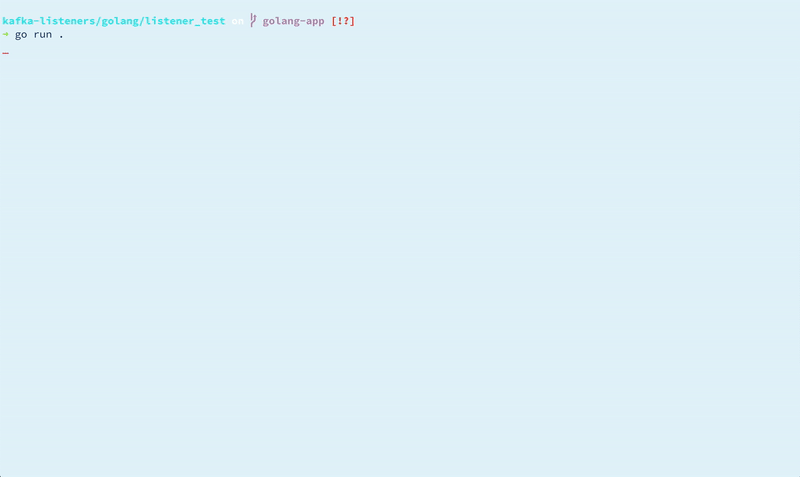

Checking Kafka advertised.listeners with Go'

When I https://rmoff.net/2020/06/25/learning-golang-some-rough-notes-s01e00/[set out] to learn something new (Go), I had in mind to use it to write a version of a utility that I'd previously https://github.com/rmoff/kafka-listeners/blob/master/python/python_kafka_test_client.py[hacked together in Python] that checks your Apache Kafka broker configuration for possible problems with the infamous `advertised.listeners` setting. Check out a blog that I wrote which explains _https://www.confluent.io/blog/kafka-client-cannot-connect-to-broker-on-aws-on-docker-etc[all about Apache Kafka and listener configuration]_.

NOTE: You can find the code at https://github.com/rmoff/kafka-listeners

It's been a fun journey, and I am pleased to be able to show the results of it. 

You can run the code directly with go: 

[source,bash]
----
➜ go run .
(A single commandline argument should be used to specify the broker. Defaulting to localhost:9092)
Using Broker: localhost:9092
--------------------------

✔️ Created AdminClient
✔️ Metadata - Originating broker [i.e. the broker to which you're connected here]
	[ID 1] localhost:9092/1
…
----

And you can also build it to create a single executable

[source,bash]
----
go build
----

[source,bash]
----
➜ ./listener_test asgard05.moffatt.me:9092
Using Broker: asgard05.moffatt.me:9092
--------------------------

✔️ Created AdminClient
✔️ Metadata - Originating broker [i.e. the broker to which you're connected here]
	[ID 1] asgard05.moffatt.me:9092/1
✔️ Metadata - Brokers [i.e. the advertised listeners of the brokers in the cluster]
	[ID 2] asgard05.moffatt.me:19092
	[ID 3] asgard05.moffatt.me:29092
	[ID 1] asgard05.moffatt.me:9092

✔️ ClusterID: Vf5L7L88QC66PLYDjN5Qvg
✔️ ControllerID: 3
✅ AdminClient worked
…
----

The rest of this article gives you some sample outputs for given situations. 

== Broker up but advertised.listeners is misconfigured

[source,bash]
----
(A single commandline argument should be used to specify the broker. Defaulting to localhost:9092)
Using Broker: localhost:9092
--------------------------

✔️ Created AdminClient
✔️ Metadata - Originating broker [i.e. the broker to which you're connected here]
        [ID -1] localhost:9092/bootstrap
✔️ Metadata - Brokers [i.e. the advertised listeners of the brokers in the cluster]
        [ID 1] foobar:9092

😱 😱 😱 😱 😱 😱 😱 😱
🛑 None of the advertised listeners on the cluster match the broker (localhost:9092) to which you're connecting.

You're gonna have a bad time trying to produce or consumer with the config like this.

🔗 Check out https://www.confluent.io/blog/kafka-client-cannot-connect-to-broker-on-aws-on-docker-etc to understand more
✔️ ClusterID: vF4bIJeiQFiS7abLjBZ1tA
✔️ ControllerID: 1
✅ AdminClient worked
--------------------------

❌There was a problem calling the producer:

☠️ Uh oh, caught an error:
        foobar:9092/1: Failed to resolve 'foobar:9092': nodename nor servname provided, or not known (after 2ms in state CONNECT)
⚠️ Failed to flush all messages after 5000 milliseconds. 1 message(s) remain

----

== Everything a-ok 👌

[source,bash]
----
Using Broker: localhost:9092
--------------------------

✔️ Created AdminClient
✔️ Metadata - Originating broker [i.e. the broker to which you're connected here]
        [ID 1] localhost:9092/1
✔️ Metadata - Brokers [i.e. the advertised listeners of the brokers in the cluster]
        [ID 1] localhost:9092

✔️ ClusterID: KJeOfk4KTjegF1oH-UOwjg
✔️ ControllerID: 1
✅ AdminClient worked
--------------------------

✔️ Message 'foo / Fri, 17 Jul 2020 15:43:30 +0100' delivered to topic 'rmoff_test_00' (partition 0 at offset 0)
✨ All messages flushed from the queue
✅ Producer worked
--------------------------

Starting consumer, 👀 looking for specific message:
        foo / Fri, 17 Jul 2020 15:43:30 +0100

Subscribed to topic rmoff_test_00……
……
……
……
……
……
……
……
Partition 0 position unset
✅ Message 'foo / Fri, 17 Jul 2020 15:43:30 +0100' received from topic 'rmoff_test_00' (partition 0 at offset 0)
✔️ Read the message we were waiting for. Closing the consumer.
✅ Consumer worked
--------------------------
----

== Broker down

[source,bash]
----
Using Broker: localhost:9092
--------------------------

✔️ Created AdminClient
❌There was a problem calling the Admin Client:
😢 Error (Local: Broker transport failure) getting cluster Metadata. Is localhost:9092 valid broker and reachable from the machine on which this is running?
----

include::/Users/rmoff/git/rmoff-blog/content/go-series.adoc[]