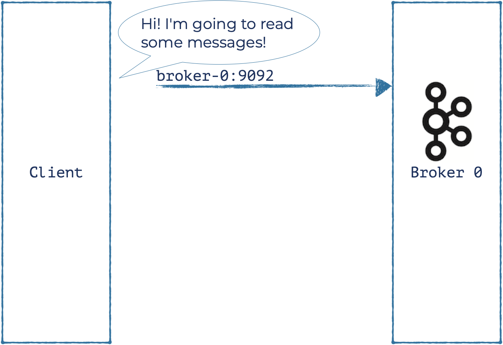
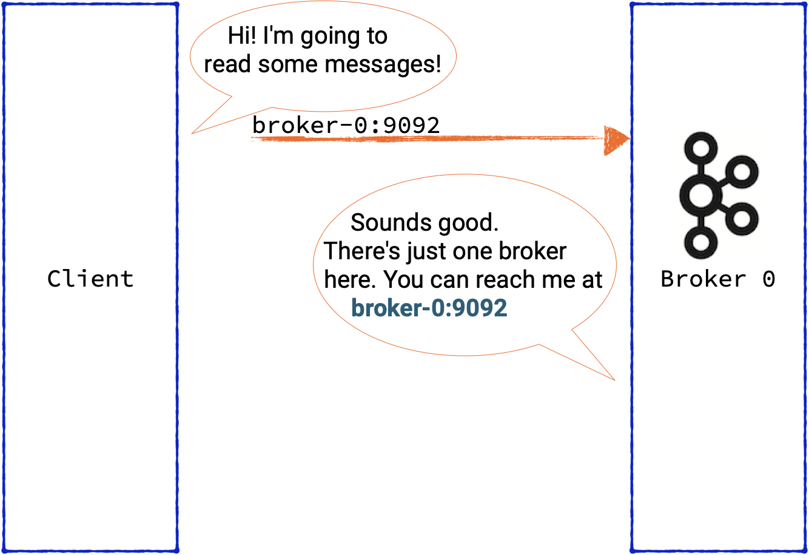
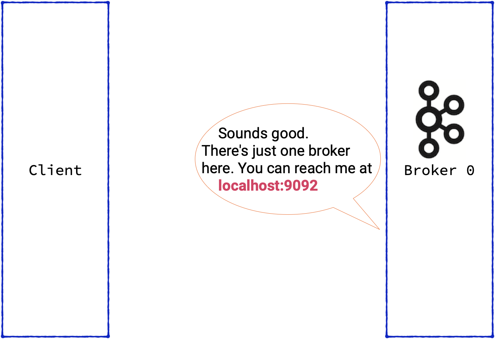
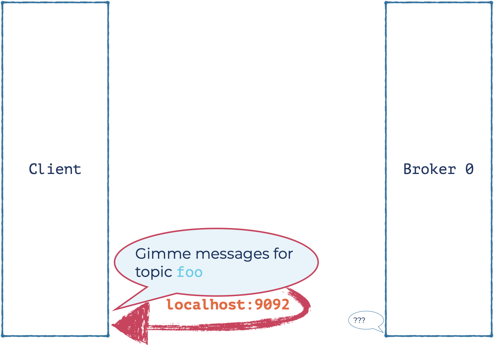
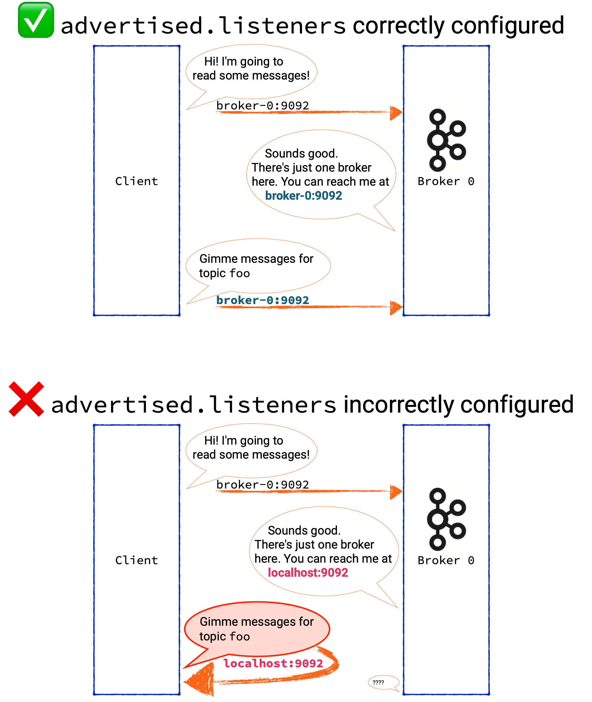

= Why can't my <Python|Java|Spring|Go|etc> client access Kafka on <Docker|another machine|AWS|etc> ?

== tl;dr

When a client wants to send or receive a message from Kafka, there are *two* connections that must succeed: 

1. The *initial* connection to a broker (the bootstrap). This returns to the client metadata including a list of all the brokers in the cluster. 
2. The client then connects to one of the brokers *returned in the first step* according to which broker is the leader for the partition that the client is producing or consuming to or from. If the broker has not been configured correctly then the value returned is incorrect.

What sometimes happens is that people focus on only step 1 above, and get caught out by step 2. The broker details returned in step 1 are defined by the `advertised.listeners` setting of the broker(s) and *must* be resolvable and accessible from the client machine. 

To read more about the protocol see the https://kafka.apache.org/protocol#protocol_partitioning[docs here], as well as this previous https://rmoff.net/2018/08/02/kafka-listeners-explained/[explanatory article] that I wrote. 

Below I use a client connecting to Kafka in various permutations of deployment topology. It's written using Python with librdkafka (`confluent_kafka`) but the principle applies to clients across all languages. You can find the https://github.com/rmoff/kafka-listeners/blob/master/python/python_kafka_test_client.py[code on GitHub here]. It's very simple and just serves to illustrate the connection process. It's simplified to benefit clarity, at the expense of good coding and functionality :) 

== An illustrated example

Let's imagine we have two servers. On one is our client, and on the other is our Kafka cluster's single broker (forget for a moment that Kafka clusters usually have a minimum of three brokers). 

First, the client initiates a connection to the bootstrap server(s), which is one (or more) of the brokers on the cluster. 

The broker returns metadata, which includes the host + port on which all the brokers in the cluster can be reached

This list is what the client then uses for all subsequent connections to produce or consume data. It will connect directly to one or more of the brokers based on which is the leader for the topic partition with which it wants to interact. 

image::images/step03.png[]

What often goes wrong is that the broker is misconfigured and returns an address on which the client cannot correctly connect to the broker: 

The client then tries to connect to this incorrect address, and then fails

In this article I'm going to walk through some common scenarios and explain how to fix each one. 

== Client and Kafka running on the same local machine

For this example, I'm running https://www.confluent.io/download/[Confluent Platform] on my local machine. You can run this, or any other Apache Kafka distribution you care to.

[source,bash]
----
➜ confluent local status kafka
…
kafka is [UP]
zookeeper is [UP]
----

My python client is connecting with a bootstrap server setting of `localhost:9092`

This works just fine: 

[source,bash]
----
➜ python python_kafka_test_client.py localhost:9092

🥾 bootstrap server: localhost:9092

    ✅ Connected to bootstrap server(localhost:9092) and it returned metadata for brokers as follows:
    ---------------------
        {0: BrokerMetadata(0, 192.168.10.182:9092)}
    ---------------------
    ℹ️  This step just confirms that the bootstrap connection was successful.
    ℹ️  For the consumer to work your client will also need to be able to resolve the broker(s) returned
         in the metadata above.
    ℹ️  If the host(s) shown are not accessible from where your client is running you need to change
         your advertised.listener configuration on the Kafka broker(s).

<Producing>
✅  📬  Message delivered: "foo / 2020-04-27 22:54:46" to test_topic [partition 0]

<Consuming>
✅  💌  Message received:  "foo / 2020-04-27 22:54:46" from topic test_topic
----

NOTE: the broker metadata returned is `192.168.10.182` but since that's the IP of my local machine it works just fine. 

== Client and Kafka running on the different machines

Now let's check the connection to a Kafka broker running on another machine. This could be a machine on your local network, or perhaps running on cloud infrastructure such as AWS, GCP, or Azure.

In my example my client is running on my laptop, connecting to Kafka running on another machine on my LAN called `asgard05`: 

[source,bash]
----
➜ python python_kafka_test_client.py asgard05.moffatt.me:9092

🥾 bootstrap server: asgard05.moffatt.me:9092

    ✅ Connected to bootstrap server(asgard05.moffatt.me:9092) and it returned metadata for brokers as follows:
    ---------------------
        {2: BrokerMetadata(2, localhost:19092), 3: BrokerMetadata(3, localhost:29092), 1: BrokerMetadata(1, localhost:9092)}
    ---------------------
    ℹ️  This step just confirms that the bootstrap connection was successful.
    ℹ️  For the consumer to work your client will also need to be able to resolve the broker(s) returned
         in the metadata above.
    ℹ️  If the host(s) shown are not accessible from where your client is running you need to change
         your advertised.listener configuration on the Kafka broker(s).
----

The initial connection succeeds. But note that the BrokerMetadata we get back shows that there are three brokers, each with a hostname of `localhost`. *That means that our client is going to be using `localhost` to try to connect to a broker when producing and consuming messages*. That's bad news, because there is no Kafka broker at `localhost` (or if there happened to be, some _really weird_ things would probably happen). And thus it comes to pass: 

[source,bash]
----
  Message delivery failed: KafkaError{code=_MSG_TIMED_OUT,val=-192,str="Local: Message timed out"}
  Consumer error: KafkaError{code=_TRANSPORT,val=-195,str="FindCoordinator response error: Local: Broker transport failure"}
----

So how do we fix it? We go and speak to our lovely Kafka administrator (who may well be us) and fix the `server.properties` on the broker(s) so that `advertised.listeners` correctly provides the hostname and port *on which the broker can be reached from clients*. We saw above that it was returning `localhost` and three different ports. That's because in this case I have three brokers on one machine (for testing purposes). Let's go and fix this. In my broker's `server.properties` I take this: 

[source,bash]
----
advertised.listeners=PLAINTEXT://localhost:9092
listener.security.protocol.map=PLAINTEXT:PLAINTEXT
listeners=PLAINTEXT://0.0.0.0:9092
----

and change the `advertised.listeners` configuration thus:

[source,bash]
----
advertised.listeners=PLAINTEXT://asgard05.moffatt.me:9092
listener.security.protocol.map=PLAINTEXT:PLAINTEXT
listeners=PLAINTEXT://0.0.0.0:9092
----

The `listener` itself remains unchanged (it binds to all available NICs, on port 9092). The only difference is that this listener will tell a client that it is to be reached on `asgard05.moffatt.me` instead of `localhost`.

So after applying these changes to the `advertised.listener` on each broker and restarting each on of them, the producer and consumer work correctly:

[source,bash]
----
➜ python python_kafka_test_client.py asgard05.moffatt.me:9092

🥾 bootstrap server: asgard05.moffatt.me:9092

    ✅ Connected to bootstrap server(asgard05.moffatt.me:9092) and it returned metadata for brokers as follows:
    ---------------------
        {2: BrokerMetadata(2, asgard05.moffatt.me:19092), 3: BrokerMetadata(3, asgard05.moffatt.me:29092), 1: BrokerMetadata(1, asgard05.moffatt.me:9092)}
    ---------------------
    ℹ️  This step just confirms that the bootstrap connection was successful.
    ℹ️  For the consumer to work your client will also need to be able to resolve the broker(s) returned
         in the metadata above.
    ℹ️  If the host(s) shown are not accessible from where your client is running you need to change
         your advertised.listener configuration on the Kafka broker(s).

<Producing>
✅  📬  Message delivered: "foo / 2020-04-27 22:54:46" to test_topic [partition 0]

<Consuming>
✅  💌  Message received:  "foo / 2020-04-27 22:54:46" from topic test_topic
----

The broker metadata is showing now with a hostname that correctly resolves from the client.

NOTE: The different ports are because there are three brokers on the same machine. 

== Kafka and Client running in Docker

Now we're going to get into the wonderful world of Docker. Docker networking is a beast in its own right and I am not going to cover it here because Kafka listeners alone are enough to digest in one article. _If you remember just one thing_, let it be this: when you run something in Docker, it executes in a container in its own little world. It has what appears to itself as its own hostname, its own network address, its own filesystem. So, for example, when you ask code in a Docker container to connect to `localhost`, it will be connecting to *itself* and _not_ the host machine on which you are running it. This catches people out, because they're used to their laptop being `localhost`, so it seems puzzling why code running on the laptop cannot connect to `localhost`. But, remember, the code isn't running on your laptop itself. It's running in a container on your laptop. 

We'll start with the simplest permutation here, and run both Kafka and our client within Docker on the same Docker network. First we build our Python client into a Docker container: 

[source,dockerfile]
.Dockerfile
----
include::python/Dockerfile[]
----

[source,bash]
----
docker build -t python_kafka_test_client .
----

Then provision a Kafka broker:

[source,bash]
----
docker network create rmoff_kafka
docker run --network=rmoff_kafka --rm --detach --name zookeeper -e ZOOKEEPER_CLIENT_PORT=2181 confluentinc/cp-zookeeper:5.5.0
docker run --network=rmoff_kafka --rm --detach --name broker \
           -p 9092:9092 \
           -e KAFKA_BROKER_ID=1 \
           -e KAFKA_ZOOKEEPER_CONNECT=zookeeper:2181 \
           -e KAFKA_ADVERTISED_LISTENERS=PLAINTEXT://localhost:9092 \
           -e KAFKA_OFFSETS_TOPIC_REPLICATION_FACTOR=1 \
           confluentinc/cp-kafka:5.5.0
----

Note that we're creating our own Docker network on which to run these containers, so that we can communicate between them. Even though they're running on Docker on my laptop, so far as each container is concerned they're on separate machines and communicating across a network. 

Let's spin up the client and see what happens: 

[source,bash]
----
docker run --network=rmoff_kafka --rm --name python_kafka_test_client \
        --tty python_kafka_test_client broker:9092
----

[source,bash]
----
🥾 bootstrap server: broker:9092

    ✅ Connected to bootstrap server(broker:9092) and it returned metadata for brokers as follows:

    {1: BrokerMetadata(1, localhost:9092)}
        ---------------------
        ℹ️  This step just confirms that the bootstrap connection was successful.
        ℹ️  For the consumer to work your client will also need to be able to resolve the broker(s) returned
            in the metadata above.
        ℹ️  If the host(s) shown are not accessible from where your client is running you need to change
            your advertised.listener configuration on the Kafka broker(s).

<Producing>
❌ Message delivery failed (1 message(s) still remain, did we timeout sending perhaps?)

<Consuming>
❌ No message(s) consumed (maybe we timed out waiting?)
----

You can see in the metadata returned that even though we successfully connect to the broker initially, it gives us `localhost` back as the broker host, and so the producer and consumer fail because they'll be trying to connect to that—and `localhost` from the client container is itself, not the broker. 

To fix it? Tell the broker to advertise its listener correctly. We change

[source,bash]
----
    -e KAFKA_ADVERTISED_LISTENERS=PLAINTEXT://localhost:9092 \
----

to

[source,bash]
----
    -e KAFKA_ADVERTISED_LISTENERS=PLAINTEXT://broker:9092 \
----

So now our broker looks like this: 

[source,bash]
----
docker stop broker
docker run --network=rmoff_kafka --rm --detach --name broker \
           -p 9092:9092 \
           -e KAFKA_BROKER_ID=1 \
           -e KAFKA_ZOOKEEPER_CONNECT=zookeeper:2181 \
           -e KAFKA_ADVERTISED_LISTENERS=PLAINTEXT://broker:9092 \
           -e KAFKA_OFFSETS_TOPIC_REPLICATION_FACTOR=1 \
           confluentinc/cp-kafka:5.5.0
----

and the client works just perfectly: 

[source,bash]
----
🥾 bootstrap server: broker:9092

    ✅ Connected to bootstrap server(broker:9092) and it returned metadata for brokers as follows:

    {1: BrokerMetadata(1, broker:9092)}
        ---------------------
        ℹ️  This step just confirms that the bootstrap connection was successful.
        ℹ️  For the consumer to work your client will also need to be able to resolve the broker(s) returned
            in the metadata above.
        ℹ️  If the host(s) shown are not accessible from where your client is running you need to change
            your advertised.listener configuration on the Kafka broker(s).

<Producing>
✅  📬  Message delivered: "foo / 2020-04-28 09:55:44" to test_topic [partition 0]

<Consuming>
✅  💌  Message received:  "foo / 2020-04-28 09:55:44" from topic test_topic
----

=== Kafka in Docker Compose

Mucking about with commandline flags for configuration of Docker containers gets kind of gross after a short amount of time. Much better is to use Docker Compose. Here's a Docker Compose for our little setup. 

[source,yaml]
.docker-compose.yml
----
include::python/docker-compose_initial.yml[]
----

Make sure you've shutdown the Docker containers above first (`docker rm -f kafka; docker rm -f zookeeper`) and then making sure you're in the same folder as the above `docker-compose.yml` run: 

[source,bash]
----
docker-compose up
----

You'll see Zookeeper and the Kafka broker start, and then the Python test client: 

[source,bash]
----
python_kafka_test_client |
python_kafka_test_client | 🥾 bootstrap server: broker:9092
python_kafka_test_client |
python_kafka_test_client |     ✅ Connected to bootstrap server(broker:9092) and it returned metadata for brokers as follows:
python_kafka_test_client |
python_kafka_test_client |     {1: BrokerMetadata(1, broker:9092)}
python_kafka_test_client |         ---------------------
python_kafka_test_client |         ℹ️  This step just confirms that the bootstrap connection was successful.
python_kafka_test_client |         ℹ️  For the consumer to work your client will also need to be able to resolve the broker(s) returned
python_kafka_test_client |             in the metadata above.
python_kafka_test_client |         ℹ️  If the host(s) shown are not accessible from where your client is running you need to change
python_kafka_test_client |             your advertised.listener configuration on the Kafka broker(s).
python_kafka_test_client |
python_kafka_test_client |
python_kafka_test_client | <Producing>
python_kafka_test_client | ✅  📬  Message delivered: "foo / 2020-04-28 10:19:29" to test_topic [partition 0]
python_kafka_test_client |
python_kafka_test_client | <Consuming>
python_kafka_test_client | ✅  💌  Message received:  "foo / 2020-04-28 10:19:29" from topic test_topic
python_kafka_test_client |
python_kafka_test_client exited with code 0
----

Pretty nice, huh 👍

You can find full-blown Docker Compose files for Apache Kafka and Confluent Platform including multiple brokers https://github.com/confluentinc/cp-all-in-one[in this repository]. 

== Kafka in Docker container, client running locally

What if you want to run your client locally? Perhaps that's where your IDE resides, or you just don't want to Docker-ify your client? Let's take the example we finished up with above, in which Kafka is running in Docker. If we try to connect our client to it locally, it fails: 

[source,bash]
----
➜ python python_kafka_test_client.py localhost:9092

🥾 bootstrap server: localhost:9092

    ❌ Failed to connect to bootstrap server.

    👉 KafkaError{code=_TRANSPORT,val=-195,str="Failed to get metadata: Local: Broker transport failure"}

    ℹ️  Check that Kafka is running, and that the bootstrap server you've provided (localhost:9092) is reachable from your client

----

Ah, but above we were using a private Docker network for the containers, and we've not opened up any port for access from the host machine. Let's change that, and expose 9092 to the host. I'm going to do this in the Docker Compose YAML - if you want to run it from `docker run` directly you can, but you'll need to translate the Docker Compose into CLI directly (which is a faff and ugly, and why you should just use Docker Compose 😉):

[source,bash]
----
…
  broker:
    image: confluentinc/cp-kafka:5.5.0
    container_name: broker
    ports: 
      - "9092:9092"
…
----

You can run `docker-compose up -d` and it will restart any containers for which the configuration has changed (i.e. `broker`). Note that if you just `docker-compose restart broker` it will restart the container _using its existing configuration_ (and not pick up the `ports` addition). 

Once we've restarted the container we can check that port 9092 is being forwarded 

[source,bash]
----
➜ docker ps -a
CONTAINER ID        IMAGE                             …  PORTS                          NAMES
37f5df65e9fc        confluentinc/cp-kafka:5.5.0       …  0.0.0.0:9092->9092/tcp         broker
…
----

Let's try our local client again. It starts off well - we can connect!

[source,bash]
----
➜ python python_kafka_test_client.py localhost:9092

🥾 bootstrap server: localhost:9092

    ✅ Connected to bootstrap server(localhost:9092) and it returned metadata for brokers as follows:

----

but then things turn sour: 

[source,bash]
----
    {1: BrokerMetadata(1, broker:9092)}
        ---------------------
        ℹ️  This step just confirms that the bootstrap connection was successful.
        ℹ️  For the consumer to work your client will also need to be able to resolve the broker(s) returned
            in the metadata above.
        ℹ️  If the host(s) shown are not accessible from where your client is running you need to change
            your advertised.listener configuration on the Kafka broker(s).

<Producing>
❌ Message delivery failed (1 message(s) still remain, did we timeout sending perhaps?)

<Consuming>
❌ No message(s) consumed (maybe we timed out waiting?)
----

Whilst we can connect to the bootstrap server, it returns `broker:9092` in the metadata. This is exactly what we told it to do in the previous section, when we were fixing it to work with clients running _within the Docker network_. If we change `advertised.listener` back to `localhost` now, the Kafka broker won't work except for connections from the host. So how do we juggle connections both within and external to Docker? We create a *new* listener. Brokers can have multiple listeners, for exactly this purpose. Network topologies get funky, and when the going get funky Kafka rocks out some more listeners. 

The changes looks like this: 

[source,yaml]
----
…
    ports: 
      - "19092:19092"
    environment:
      KAFKA_ADVERTISED_LISTENERS: PLAINTEXT://broker:9092,CONNECTIONS_FROM_HOST://localhost:19092
      KAFKA_LISTENER_SECURITY_PROTOCOL_MAP: PLAINTEXT:PLAINTEXT,CONNECTIONS_FROM_HOST:PLAINTEXT
…      
----

We create a *new* listener, using port 19092. Because we've changed the port, we change the `ports` mapping. Crucially the new `advertised.listener` is on `localhost`. The existing one (`PLAINTEXT`) remains unchanged. We also need to specify `KAFKA_LISTENER_SECURITY_PROTOCOL_MAP` — this previously used a default value for the single listener but now that we've added another we need to configure it explicitly. 

After bouncing the broker to pick up the new config our local client works perfectly - so long as we remember to point it at the *new* listener port (19092): 

[source,bash]
----
➜ python python_kafka_test_client.py localhost:19092

🥾 bootstrap server: localhost:19092

    ✅ Connected to bootstrap server(localhost:19092) and it returned metadata for brokers as follows:

    {1: BrokerMetadata(1, localhost:19092)}
        ---------------------
        ℹ️  This step just confirms that the bootstrap connection was successful.
        ℹ️  For the consumer to work your client will also need to be able to resolve the broker(s) returned
            in the metadata above.
        ℹ️  If the host(s) shown are not accessible from where your client is running you need to change
            your advertised.listener configuration on the Kafka broker(s).

<Producing>
✅  📬  Message delivered: "foo / 2020-04-28 11:41:22" to test_topic [partition 0]

<Consuming>
✅  💌  Message received:  "foo / 2020-04-28 11:41:22" from topic test_topic
----

And over in Docker Compose we can see that our Docker-based client _also still works._

[source,bash]
----
…
python_kafka_test_client |     ✅ Connected to bootstrap server(broker:9092) and it returned metadata for brokers as follows:
python_kafka_test_client |
python_kafka_test_client |     {1: BrokerMetadata(1, broker:9092)}
…
python_kafka_test_client | ✅  📬  Message delivered: "foo / 2020-04-28 11:41:09" to test_topic [partition 0]
…
python_kafka_test_client | ✅  💌  Message received:  "foo / 2020-04-28 11:41:09" from topic test_topic
----

== Kafka running locally, client in Docker container

What about if we invert this, and have Kafka running locally on our laptop just as we did originally, and instead run the client in Docker? It's not an obvious way to be running things, but `¯\\_(ツ)_/¯`

First I shut down the Docker containers from above (`docker-compose down`) and then start Kafka running locally (`confluent local start kafka`). If we run our client in its Docker container, we can see it's not happy: 

[source,bash]
----
➜ docker run --tty python_kafka_test_client localhost:9092

🥾 bootstrap server: localhost:9092

      Failed to connect to bootstrap server.

    👉 KafkaError{code=_TRANSPORT,val=-195,str="Failed to get metadata: Local: Broker transport failure"}

    ℹ️   Check that Kafka is running, and that the bootstrap server you've provided (localhost:9092) is reachable from your clientdocker run --tty python_kafka_test_client localhost:9092
----

If you remember the Docker/`localhost` paradox described above you'll see what's going on here. Within the client's Docker container, `localhost` is itself - it's not "`localhost`" that we think of our laptop, the Docker host, being. And of course, on our client's Docker container there is no Kafka broker running at 9092, hence the error. If you don't quite believe me then run this, which checks from within the Docker container if port 9092 is open: 

[source,bash]
----
➜ docker run -it --rm --entrypoint "/bin/nc" \
    python_kafka_test_client -vz \
    localhost 9092
localhost [127.0.0.1] 9092 (?) : Connection refused
----

On the Docker host machine, Kafka is up and the port is open: 

[source,bash]
----
➜ nc -vz localhost 9092
Connection to localhost port 9092 [tcp/XmlIpcRegSvc] succeeded!
----

So how do we connect our client to our host? There are two reasons you'll be in this state: 

* You're at this point because you're just developing things and trying to get stuff working in whatever way you can, and will worry about "properly" later
* You're building a client application that will run on Docker and connect to Kafka running elsewhere

For the latter scenario you need to refer above to the "client and Kafka on different machines" and make sure that (i) the brokers advertise their correct listener details and (ii) the container can correctly resolve these host addresses. 

For the former, trying to access Kafka running locally from a client running in Docker, you have a few options, none of which are particularly pleasant. If you're running Docker on the Mac, there's a hacky workaround to use `host.docker.internal` as the address on which the host machine can be accessed from within the container: 

[source,bash]
----
➜ docker run -it --rm --entrypoint "/bin/nc" \
    python_kafka_test_client -vz \
    host.docker.internal 9092

host.docker.internal [192.168.65.2] 9092 (?) open
----

So the container can see the host's 9092 port. What if we try to connect to that from our actual Kafka client? 

[source,bash]
----
➜ docker run --tty python_kafka_test_client host.docker.internal:9092

🥾 bootstrap server: host.docker.internal:9092

    ✅ Connected to bootstrap server(host.docker.internal:9092) and it returned metadata for brokers as follows:
    ---------------------
        {0: BrokerMetadata(0, localhost:9092)}
    ---------------------
    ℹ️  This step just confirms that the bootstrap connection was successful.
    ℹ️  For the consumer to work your client will also need to be able to resolve the broker(s) returned
         in the metadata above.
    ℹ️  If the host(s) shown are not accessible from where your client is running you need to change
         your advertised.listener configuration on the Kafka broker(s).

…
----

So the initial connect _actually works_, but check out the metadata we get back : `localhost:9092`. Why? Because `advertised.listeners`. So now the producer and consumer won't work, because they're trying to connect to `localhost:9092` _within the container_, which won't work. Hack time? OK. Let's take our poor local Kafka broker and kludge it to expose a listener on `host.docker.internal`. 

Because we don't want to break the Kafka broker for other clients that are _actually_ wanting to connect on `localhost` we'll create ourselves a new listener. Change the `server.properties` on the broker from: 

[source,bash]
----
listeners=PLAINTEXT://:9092
advertised.listeners=PLAINTEXT://localhost:9092
listener.security.protocol.map=PLAINTEXT:PLAINTEXT
----

to:

[source,bash]
----
listeners=PLAINTEXT://:9092,RMOFF_DOCKER_HACK://:19092
advertised.listeners=PLAINTEXT://localhost:9092,RMOFF_DOCKER_HACK://host.docker.internal:19092
listener.security.protocol.map=PLAINTEXT:PLAINTEXT,RMOFF_DOCKER_HACK:PLAINTEXT
----

The original listener remains unchanged. The magic thing we've done here though is add a _new_ listener (`RMOFF_DOCKER_HACK`) which is on a *new port*. If you connect to the broker on 9092 you'll get the `advertised.listener` defined for the listener on that port (`localhost`). And if you connect to the broker on 19092 you'll get the alternative host & port: `host.docker.internal:19092`. 

Let's try it out (make sure you've restarted the broker first to pick up these changes): 

[source,bash]
----
➜ docker run --tty python_kafka_test_client host.docker.internal:19092

🥾 bootstrap server: host.docker.internal:19092

    ✅ Connected to bootstrap server(host.docker.internal:19092) and it returned metadata for brokers as follows:
    ---------------------
        {0: BrokerMetadata(0, host.docker.internal:19092)}
    ---------------------
    ℹ️  This step just confirms that the bootstrap connection was successful.
    ℹ️  For the consumer to work your client will also need to be able to resolve the broker(s) returned
         in the metadata above.
    ℹ️  If the host(s) shown are not accessible from where your client is running you need to change
         your advertised.listener configuration on the Kafka broker(s).

<Producing>
✅  📬  Message delivered: "foo / 2020-04-27 21:57:06" to test_topic [partition 0]

<Consuming>
✅  💌  Message received:  "foo / 2020-04-27 21:57:06" from topic test_topic
----

It works! It's a *DIRTY HACK*, but it works 😅.

== FAQs

=== Couldn't I just hack my `/etc/hosts` file? 

* Can you? Yes
* Should you? *NO*! :) 

Not unless you want your client to randomly stop working each time you deploy it on a machine that you forget to frig the hosts file for. The whole point of hostnames and DNS resolution is that they are how machines know how to talk to each other instead of you hardcoding it into each machine individually. 

=== I don't have `advertised.listeners` set in my server.properties

By default it'll take the same value as the listener itself. You can validate the settings in use by checking the broker log file: 

[source,bash]
----
[2020-04-27 21:21:00,939] INFO KafkaConfig values:
        advertised.host.name = null
        advertised.listeners = PLAINTEXT://localhost:9092,RMOFF_DOCKER_HACK://host.docker.internal:19092
        advertised.port = null
…

        listener.security.protocol.map = PLAINTEXT:PLAINTEXT,RMOFF_DOCKER_HACK:PLAINTEXT
        listeners = PLAINTEXT://:9092,RMOFF_DOCKER_HACK://:19092
…
----

=== What about `advertised.host.name` and `advertised.port`? 

They're deprecated. Don't use them. 

=== But…I can telnet to the broker just fine so surely it should just work? 

Yes, you need to be able to reach the broker on the host and port you provide in your initial bootstrap connection—but as explained above it's the *subsequent* connections to the host&port returned in the _metadata_ that must also be accessible from your client machine. 

=== Do I have to use Python to do this? 

Nope - any client library (see the list https://docs.confluent.io/current/clients/index.html#ak-clients[here] and https://github.com/confluentinc/examples/blob/5.5.0-post/clients/cloud/README.md[here]) should be able to expose the metadata too. Here's an example using kafkacat: 

[source,bash]
----
➜ kafkacat -b asgard05.moffatt.me:9092 -L
Metadata for all topics (from broker 1: asgard05.moffatt.me:9092/1):
 3 brokers:
  broker 2 at asgard05.moffatt.me:19092
  broker 3 at asgard05.moffatt.me:29092
  broker 1 at asgard05.moffatt.me:9092 (controller)
----

You can also use `kafkacat` from Docker, but then you get into some funky networking implications if you're trying to troubleshoot something on the local network. 